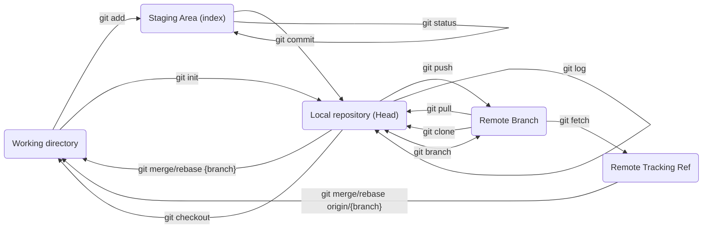

# Git

## Table of contents

1. [Overview](#overview)
2. [Git Commands](#git-commands)
   1. [Local Commands](#local-commands)
      1. [version](#version)
      2. [config](#config)
      3. [status](#status)
      4. [init](#init)
      5. [add](#add)
      6. [commit](#commit)
      7. [log](#log)
      8. [checkout](#checkout)
      9. [branch](#branch)
      10. [rebase](#rebase)
   2. [Remote Commands](#remote-commands)
      1. [clone](#clone)
      2. [remote](#remote)
      3. [pull](#pull)
      4. [push](#push)
      5. [merge](#merge)
      6. [fetch](#fetch)
3. [Working as a team](#working-as-a-team)
   1. [Github](#github)
   2. [Avoiding Conflicts](#avoiding-conflicts)
   3. [Branches](#branches)
4. [FAQ](#faq)
   1. [I can't see a branch?](#i-cant-see-a-branch)
   2. [How do I keep my branch up to date?](#how-do-i-keep-my-branch-up-to-date)
   3. [How do I rename my last commit?](#how-do-i-rename-my-last-commit)
   4. [How do I add changes to my last commit?](#how-do-i-add-changes-to-my-last-commit)
   5. [How do I rename, or combine commits?](#how-do-i-rename-or-combine-commits)
   6. [How do I solve a merge conflict?](#how-do-i-solve-a-merge-conflict)

## Overview



## Git Commands

### Local commands

#### version

The `git version` command shows what version of git you're using.

Usage:

```sh
git version
```

[Documentation](https://git-scm.com/docs/git#Documentation/git.txt---version)

#### config

The `git config` command is used for changing a git setting. This can be done globally or done per repository (see the `--global` and `--local`) flags. Two common settings are the username and email which can be specified with `user.name` and `user.email` setting.

Usage:

```sh
git config [--global, --local] <setting> <value>
```

[Documentation](https://git-scm.com/docs/git-config)

#### status

The `git status` command is used for displaying the current status of the repository. It will show files modified, removed or added files and if they're staged for commit.

Usage:

```sh
git status
```

[Documentation](https://git-scm.com/docs/git-status)

#### init

The `git init` command is used for adding git to a project or folder. The command creates a new subdirectory named `.git` which contains all repository files.

Usage:

```sh
git init <optional name>
```

[Documentation](https://git-scm.com/docs/git-init)

#### add

The `git add` command is used for tracking a files changes, this is also called staging. The command accepts wildcards `*` in the files path allowing you to add multiple files at once. You can also add an entire directory and its contents using a relative such as `.` or `..`.

Usage:

```sh
git add <path>
```

[Documentation](https://git-scm.com/docs/git-add)

#### commit

The `git commit` command is used for saving the tracked changes to the git repository. You can use the `-m <title>` argument for directly specifying a commit title. If ommitted it will just open your default text editr as specified in git and ask you to input a name or accept the default one, which is the name of a file you've edited.

Usage:

```sh
git commit [args]
```

[Documentation](https://git-scm.com/docs/git-commit)

#### log

The `git log` command is used for showing the log of commits.

Usage:

```sh
git log
```

[Documentation](https://git-scm.com/docs/git-log)

#### checkout

The `git checkout` command is used for switching branch or restoring the files in the working directory to the latest commit. The `--branch <name>` argument specifies which branch to create, however if that branch already exists it will switch to that branch and reset.

Usage:

```sh
git checkout [args]
```

[Documentation](https://git-scm.com/docs/git-checkout)

#### branch

The `git branch` command is used for listing, creating or deleting branches. Commonly used arguments are `--move`, `--copy`, `--delete` and `--list`.

Usage:

```sh
git branch [args]
```

[Documentation](https://git-scm.com/docs/git-branch)

#### rebase

The `git rebase` command is used for moving commits on to the tip of another branch. This can be used for avoiding merge commits. The branch argument (as seen in usage) is the target branch that you want to rebase to. It's highly recommended to read the documentation page for visual demonstration as well as a list of all available arguments.

Usage:

```sh
git rebase <branch>
```

[Documentation](https://git-scm.com/docs/git-rebase)

### Remote commands

#### clone

The `git clone` command is used for for downloading, cloning, an existing repository. You can use the `--branch <name>` argument to specify which branch of the repositroy it should clone.

Usage:

```sh
git clone <url> [args]
```

[Documentation](https://git-scm.com/docs/git-clone)

#### remote

The `git remote` command is used for viewing and specifying remote servers that host your git repository. If you've cloned a repository it will show a remote called `origin`, which is the server you cloned from.

Usage:

```sh
git remote [add <name> <url>, remove <name>, rename <old name> <new name>]
```

[Documentation](https://git-scm.com/docs/git-remote)

#### pull

The `git pull` command is used for fetching changes of the remote repository and then merging them with the existing changes in the local repository.

Usage:

```sh
git pull <remote> <branch>
```

[Documentation](https://git-scm.com/docs/git-pull)

#### push

The `git push` command is used for sending commits stored in the local repository to the remote repository, for example Github.

Usage:

```sh
git push <remote> <branch>
```

[Documentation](https://git-scm.com/docs/git-push)

#### merge

The `git merge` command is used for merging two commit histories. Unlike [rebase](#rebase) this does not move commits the the top, but instead creates a new commit with all the missing changes.

Usage:

```sh
git merge <branch>
```

[Documentation](https://git-scm.com/docs/git-merge)

#### fetch

The `git fetch` command is used for fetching changes from the remote repository. You can merge this changes with your local ones at a later time. The `git pull` command will fetch and merge in one command.

Usage:

```sh
git fetch <remote>
```

[Documentation](https://git-scm.com/docs/git-fetch)

## Working as a team

### Github

Github is a website that works as your remote origin and allows you to host and share your git repositories. It includes useful features such as keeping track of issues, pull requests and you can even create your own wiki page.

To login to git with github you can use the [Github CLI](https://cli.github.com/)

When it's installed run the following:

```sh
gh auth login
gh auth setup-git
```

### Login with SSH

To avoid entering a username and password everytime you interact with a remote repo you can use something called a key pair. To generate and use your keys with github do the following:

1. Open Git Bash (or the terminal if you're on a unix system)
2. Create your key pair
   1. Run `ssh-keygen -t ed25519 -C "Git ssh key: youremail@yourdomain.com`. The `-t` argument specifies the key type and `-C` is a comment
   2. Give it a file name
   3. Leave the passphrase blank
   4. Leave the passphrase blank again
   5. Done! It will have created two files one ending with .pub which is the public key and the other is the private key
3. Start the ssh agent with `eval "$(ssh-agent -s)"`
4. Run `ssh-add <file name or path to file>`. Make sure to use the private key, do **NOT** use the file that ends with .pub
5. Adding public key to github
   1. Open GitHub in your browser
   2. Top right, select your profile photo and click Settings
   3. In the menu on the left, look for Access and select "SSH and GPG keys"
   4. Click New SSH Key
   5. Paste the contents of the public key (`<file name>.pub`) in to the key area
   6. Click Add SSH Key
   7. Done!

### Avoiding conflicts

A good way to avoid conflicts and keeping the code clean and structured is to split it in to multiple files. For example if you're working on a frontend application you can split commonly used components in to multiple files.

Another good way is to communicate with your team so everyone knows what you're working on. This lowers the risk that you might run in to a conflict my changing the same file.

### Branches

To prevent interfearing with others work and to keep the code organised, there are multiple branches.

There are generally four types of branches:

- main is the production branch containing the code for the latest "stable" builds of your project.

- dev is the development branch containing the latest bleeding edge features.

- feat/ indicates a feature branch. This is where a new feature is being developed. For example the name could be `feat/user-authentication`, which means this branch contains work in progress code of an user authentication feature.

- fix/ indicates that it's a bug fix branch. It works much the same way as the feature branch but it contains work in progress code for bug fixes.

When a `feat` or `fix` branch is completed it should be pulled in to the dev branch for further testing and then be deleted.

## FAQ

### I can't see a branch?

Make sure you've fetched the latest information from the remote repository by using [git fetch](#fetch).

### How do I keep my branch up to date?

To update your branch you can rebase it, which means to put your commits on top of a remote branchs. You can do so with the [git pull](#pull) or [git rebase](#rebase).

### How do I rename my last commit?

You can use the `--amend` argument together with the `-m` argument in the [git commit](#commit) command.

### How do I add changes to my last commit?

You can use the `--amend` argument argument in the [git commit](#commit) command.

### How do I rename, or combine commits?

If you're trying to rename your last commit, click [here](#how-do-i-rename-my-last-commit).

If not, you can use the git rebase command with the interactive flag. Though be careful so you don't accidentally break anything.

```sh
git rebase -i HEAD~<number_of_commits>
```

### How do I solve a merge conflict?

When a git merge fails it adds three sets of seven symboles indicating what it is that's conflicting.

- `<<<<<<<` (seven "less than" characters) followed by HEAD, which is an alias for the current branch. The symbols indicate the beginning of the edits within this section.
- `=======` (seven "equals sign" characters), which show the end of the revisions within the current branch and the beginning of the edits within a new one.
- `>>>>>>>` (seven "greater than" characters) followed by the branch where the attempted merge happened. The added symbols indicate the ending of the edits within the conflicting branch.

You can then choose the code to keep and make a new commit to solve the conflict.
